# Suriya Prasaad S

<div align="center">

[](https://git.io/typing-svg)


</div>

---

## 🌟 About Me

```javascript
const suriya = {
    location: "Puducherry, India 🇮🇳",
    education: "B.Tech IT @ Sri Manakula Vinayagar Engineering College",
    cgpa: "8.86/10.0 ⭐",
    currentRole: "Software Developer Intern @ Zoho",
    passions: ["Quantum Computing", "AI/ML", "Full Stack Development", "Problem Solving"],
    funFact: "I integrate CRMs by day and optimize quantum algorithms by night! 🌙"
};
```

<div align="center">

[](https://suriyaprasaad.netlify.app/)
[](https://linkedin.com/in/suriyaprasaad)
[](https://github.com/SURIYAPRASAAD04)
[](mailto:suriyaprasaadjayasugumar04@gmail.com)

</div>

---

## 🏆 Achievement Showcase

<div align="center">

| 🥇 **Competition** | 🎯 **Achievement** | 👥 **Scale** | 📅 **Date** |
|:------------------:|:-------------------|:-------------|:-------------|
| **Unisys Innovation Program'16** | 🥉 Pre-Finalist (Top 10) | 900+ teams | May 2025 |
| **Zoho Cliqtrix'25** | 🥈 Runner-up | 12,000+ participants | Dec 2024 |
| **Walmart Sparkathon'24** | 🎖️ Finalist (Top 8) | 13,700+ participants | Sep 2024 |
| **Adamya'24** | 🏆 Winner | 1,000+ teams | May 2024 |

</div>

<div align="center">

</div>

---

## 💼 Professional Experience

### 🏢 **Zoho Corporation** | Software Developer Intern
*Jan 2025 - Mar 2025 | Chennai (Onsite)*

```python
class ZohoInternship:
    def __init__(self):
        self.achievements = [
            "🔗 Integrated Groove CRM with Zoho Cliq using REST APIs & OAuth2",
            "⚡ Automated workflows reducing ticket processing by 89%",
            "📊 Enhanced dashboard visibility & team efficiency"
        ]
        self.tech_stack = ["REST APIs", "Webhooks", "OAuth2", "CRM Integration"]
        
    def impact(self):
        return "Streamlined operations for faster issue resolution"
```

---

## 🛠️ Tech Arsenal

<div align="center">

### 🎯 **Core Programming**


### 🌐 **Web Technologies**


### ☁️ **Cloud & DevOps**


### 🤖 **AI/ML & Quantum**


### 🗄️ **Databases**


</div>

---

## 🎨 Featured Projects

<div align="center">

</div>

### 🌐 **Latency Topology Visualizer** 
*🎯 Real-time Network Performance*
```typescript
const project = {
    tech: ["TypeScript", "Next.js", "MongoDB", "Globe.gl"],
    description: "Interactive 3D visualization of global crypto exchange latency",
    features: ["Real-time data", "AWS/GCP/Azure integration", "Globe visualization"],
    status: "🚀 Live"
};
```

### 🛡️ **Q-Defender** 
*⚛️ Post-Quantum Security Platform*
```python
quantum_security = {
    "encryption": "AES-256 + Multi-layer PQC",
    "ml_detection": "Anomaly detection algorithms",
    "risk_reduction": "60% unauthorized access prevention",
    "tech_stack": ["Python", "Next.js", "OQS", "MongoDB", "GCP"]
}
```

### 🛒 **Scan Explore** 
*🤖 AI-Powered Retail Innovation*
```javascript
const aiRetail = {
    accuracy: "95% scan precision",
    performance: "50% faster query response",
    tech: ["YOLOv8", "Cohere", "PyTorch", "AWS"],
    recognition: "Walmart Sparkathon Finalist 🏆"
};
```

### ⚛️ **Retail Replenishment Optimizer** 
*🧮 Quantum-Enhanced Supply Chain*
```python
quantum_advantage = {
    "algorithms": ["QML", "QAOA", "QFT"],
    "optimization": "70% faster computation vs classical",
    "framework": "Qiskit",
    "impact": "Revolutionary SKU placement"
}
```

### 🔐 **Education Crypt** 
*🌐 Quantum Key Distribution*
```python
secure_education = {
    "protocol": "QKD-E91",
    "security": "Quantum-encrypted communication",
    "use_case": "Secure academic data & results",
    "innovation": "Real-time quantum security"
}
```

---

## 📊 GitHub Analytics

<div align="center">


</div>

<div align="center">

[](https://git.io/streak-stats)

</div>

---

## 🎓 Certifications & Learning

<div align="center">

| 🏢 **Platform** | 📜 **Certification** | 🎯 **Focus Area** |
|:---------------:|:---------------------|:------------------|
| **IBM** | Machine Learning with Python | 🤖 AI/ML |
| **AWS** | ML & Cloud Practitioner | ☁️ Cloud Computing |
| **Google Cloud** | 5+ Generative AI Badges | 🧠 Gen AI |
| **Microsoft Azure** | AI Language & Speech | 🗣️ AI Services |
| **C-DAC** | Multilingual Programming | 💻 Programming |
| **NPTEL** | Programming in C | 🔧 Core Programming |

</div>

---

## 🎯 What I'm Working On

```mermaid
graph TD
    A[🔬 Quantum Computing Research] --> B[⚛️ Post-Quantum Cryptography]
    A --> C[🧮 Quantum Machine Learning]
    D[🤖 AI/ML Projects] --> E[👁️ Computer Vision]
    D --> F[🧠 Generative AI]
    G[🌐 Full Stack Development] --> H[⚡ Performance Optimization]
    G --> I[🔗 API Integration]
```



---

## 🌟 Fun Facts & Interests

<div align="center">

🎮 **Gaming Enthusiast** | 🎵 **Music Lover** | 📚 **Tech Blogger** | 🌱 **Open Source Contributor**


</div>

---

## 📫 Let's Connect & Collaborate!

<div align="center">

*"Innovation distinguishes between a leader and a follower." - Steve Jobs*

[](https://suriyaprasaad.netlify.app/)
[](https://linkedin.com/in/suriyaprasaad)
[](mailto:suriyaprasaadjayasugumar04@gmail.com)


### 🚀 *Ready to build the future with quantum-powered, AI-driven solutions!*

</div>

---

<div align="center">

**⭐ Star this repository if you find it interesting!**

</div>
